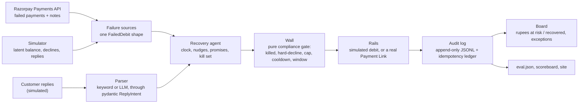

# Encore

A recovery agent for failed Indian subscription debits. It detects failed
payments on Razorpay, decides inside an NPCI-shaped compliance wall, nudges
the customer, reads the reply, collects on a real Payment Link, and puts
every rupee on a live board. The policy that ships has **no model in it**: on
a 32-cell simulator matrix it recovers **4.4x what Razorpay's documented
T+1/T+2/T+3 schedule does, with zero compliance violations in every cell**.
The trained model this project started with ties a uniform-random control on
the regime it trained on and loses to it under distribution shift, so it does
not ship. Both results, and the fifteen things that broke on the way, are in
`BROKELOG.md`, each written before its fix.

> **Read §8 before the metrics table.** Every rupee in §3 is simulator money.
> The real-rail evidence is one failed debit detected through Razorpay's
> Payments API and one real recovery link created by the agent and paid (§2),
> after two rehearsals that failed for reasons that are also logged.

## 1. The problem

UPI AutoPay mandates fail to execute at a rate that would be a P0 outage in
any other payments system, and merchants have almost no compliant room to
react. NPCI data reported by Business Standard puts UPI AutoPay revocations
at **20M+ mandates cancelled per month**, mostly over low customer balances
([Business Standard, Sept 2025](https://www.business-standard.com/finance/news/upi-autopay-revocations-hit-20-mn-monthly-over-low-customer-balances-125090700500_1.html)).
NPCI data reported via Mint puts the **August 2025 AutoPay execution failure
rate at 55–90%** across public and private banks in a single month
([Mint, via HT Syndication](https://www.htsyndication.com/mint/article/upi-autopay-s-recurring-woes-are-forcing-an-industry-rethink/93925664)).
Even in steady state, UPI AutoPay's structural failure rate sits at a reported
**8–15%, versus 2–3% for card mandates**
([productgrowth.in AutoPay guide](https://productgrowth.in/insights/fintech/upi-autopay-guide/)).
Every one of those failures is a subscription that silently churns unless
someone retries it, and NPCI's own rules constrain how: **one original
execution plus three retries, only in non-peak windows**
([Paytm, on NPCI's Aug-2025 UPI rules](https://paytm.com/blog/payments/upi/upi-rules-update-august-1-npci-new-guidelines/)).
Encore is an agent for that narrow, rule-bound retry budget: recover what
the rule allows, refuse everything it doesn't, never the reverse.

## 2. What the agent does, and which parts are real

```
detect  ->  decide  ->  nudge  ->  read the reply  ->  collect  ->  report
```

| Step | On Razorpay test mode (real) | On the simulator |
|---|---|---|
| Detect | `GET /v1/payments` lists failed attempts with an `error_reason`; the customer rides on the payment's `notes` (`src/encore/sources.py`) | `Portfolio.run_cycle` produces failed debits with a decline code |
| Decide | `wall.decide()`, the same pure function in both | same |
| Nudge | not sent; the agent records it and the wall counts it against the nudge budget | same |
| Reply | **simulated** — Hinglish templates from the simulator, parsed by the keyword parser by default (`--parser claude-sonnet-5` uses the model measured at 40/40 in §6) | same |
| Collect | a real Payment Link, paid by a human on the mock bank; the agent polls it (`src/encore/rails.py`) | `Portfolio.debit` against the latent balance |
| Book | `status: paid` on the link, or a captured payment carrying the customer's notes (self-cure) | balance cleared |

The shipped policy is `promise_aware_random` (§3): if the customer's reply
named a day, retry on that day; otherwise a uniform-random hour inside the
wall's window over the next ten days. It has no model. The stopping rules
are the wall's retry cap and the parked reasons in the exception list.

**Live run, take 3 (2026-09-02).** One real original debit for `cust_0055`
was failed on checkout, detected, and worked alongside 50 simulated failures:

```
Payments API: 1 mapped failure(s), 0 unmapped, in the last 20 min.
  LINK for cust_0055 INR 999.00: https://rzp.io/rzp/aAabolSJ  (plink_TXE1mRxcuLVWJS)  pay by 21:35:35

at risk     INR 28,049.00
recovered   INR 10,485.00  (37.4%)
attempts 87  denied 17  nudges 51  duplicates_blocked 0  paid_on_their_own 0
parked: hard_decline_terminal=13, policy_stop=19, sequence_killed=4
```

The real-rail audit record, verbatim from `docs/evidence/agent-audit-2026-09-02.jsonl`:

```json
{"event": "execution", "customer_id": "cust_0055", "attempt_id": "cust_0055:TXE0tL9so92THj:retry:1", "at_hour": 51, "outcome": "success", "amount_paise": 99900, "policy": "promise_aware_random", "original_decline": "generic_decline", "attempt_no": 1, "rail": "razorpay_test_mode", "link_id": "plink_TXE1mRxcuLVWJS", "short_url": "https://rzp.io/rzp/aAabolSJ", "status": "paid"}
```

The final board is committed as `docs/evidence/board-2026-09-02-live.html`;
the transcript is next to it. Takes 1 and 2 recovered nothing on the real
rail: a 240-second timeout the operator missed by 12 seconds, then a payment
made on the original link the agent was not watching. Both are BROKELOG
entries 14 and 15, and both changed the code (§8).

## 3. The metrics table

Pasted verbatim from `runs/eval.json`, the real output of `uv run encore eval`
with seeds `[100, 101, 102]` and `n_customers=500` per seed. Both learned
models are trained once on regime `r0_base`, seeds `1`–`5` (never an eval
seed). Money is in ₹, Indian digit grouping, exactly as `encore report`
renders it. 4 regimes × 8 policies = 32 cells.

**Read the `random_in_horizon` row before any other.** It is the control that
decides what this table shows.

| Regime | Policy | Recovered / 1000 failures | Recovery / attempt | Max contacts / customer | Parked | Violations |
|---|---|---:|---:|---:|---:|---:|
| r0_base | `immediate_x3` | ₹0.00 | ₹0.00 | 0 | ₹41,417.00 | 0 |
| r0_base | `fixed_t123` | ₹68,040.91 | ₹70.61 | 3 | ₹28,045.00 | 0 |
| r0_base | `fixed_spread10` | ₹1,65,581.82 | ₹241.25 | 3 | ₹10,980.00 | 0 |
| r0_base | `random_in_horizon` | ₹1,86,900.00 | ₹342.65 | 3 | ₹299.00 | 0 |
| r0_base | `encore_learned` | ₹1,88,259.09 | ₹426.98 | 3 | ₹0.00 | 0 |
| r0_base | `encore_learned_nopayday` | ₹1,88,259.09 | ₹435.97 | 3 | ₹0.00 | 0 |
| r0_base | `promise_aware` | ₹1,65,581.82 | ₹254.74 | 3 | ₹10,980.00 | 0 |
| r0_base | `promise_aware_random` | ₹1,81,450.00 | ₹359.63 | 3 | ₹1,498.00 | 0 |
| r1_shifted | `immediate_x3` | ₹0.00 | ₹0.00 | 0 | ₹2,07,341.00 | 0 |
| r1_shifted | `fixed_t123` | ₹52,774.63 | ₹31.01 | 3 | ₹1,72,626.00 | 0 |
| r1_shifted | `fixed_spread10` | ₹1,43,001.35 | ₹96.33 | 3 | ₹1,11,752.00 | 0 |
| r1_shifted | `random_in_horizon` | ₹2,18,948.72 | ₹165.38 | 3 | ₹45,100.00 | 0 |
| r1_shifted | `encore_learned` | ₹1,50,291.50 | ₹104.67 | 3 | ₹95,975.00 | 0 |
| r1_shifted | `encore_learned_nopayday` | ₹1,54,867.75 | ₹111.20 | 3 | ₹92,584.00 | 0 |
| r1_shifted | `promise_aware` | ₹1,58,350.88 | ₹115.15 | 3 | ₹1,00,378.00 | 0 |
| r1_shifted | `promise_aware_random` | ₹2,30,673.41 | ₹191.84 | 3 | ₹36,412.00 | 0 |
| r2_no_signal | `immediate_x3` | ₹0.00 | ₹0.00 | 0 | ₹2,63,444.00 | 0 |
| r2_no_signal | `fixed_t123` | ₹34,005.26 | ₹16.73 | 3 | ₹2,39,895.00 | 0 |
| r2_no_signal | `fixed_spread10` | ₹78,915.79 | ₹46.14 | 3 | ₹2,11,551.00 | 0 |
| r2_no_signal | `random_in_horizon` | ₹1,17,259.21 | ₹67.92 | 3 | ₹1,74,327.00 | 0 |
| r2_no_signal | `encore_learned` | ₹1,07,677.63 | ₹62.23 | 3 | ₹1,81,609.00 | 0 |
| r2_no_signal | `encore_learned_nopayday` | ₹1,07,411.84 | ₹62.75 | 3 | ₹1,81,811.00 | 0 |
| r2_no_signal | `promise_aware` | ₹78,915.79 | ₹46.14 | 3 | ₹2,11,551.00 | 0 |
| r2_no_signal | `promise_aware_random` | ₹1,14,894.74 | ₹66.91 | 3 | ₹1,76,124.00 | 0 |
| r3_noisy_promise | `immediate_x3` | ₹0.00 | ₹0.00 | 0 | ₹2,07,341.00 | 0 |
| r3_noisy_promise | `fixed_t123` | ₹52,774.63 | ₹31.01 | 3 | ₹1,72,626.00 | 0 |
| r3_noisy_promise | `fixed_spread10` | ₹1,43,001.35 | ₹96.33 | 3 | ₹1,11,752.00 | 0 |
| r3_noisy_promise | `random_in_horizon` | ₹2,18,948.72 | ₹165.38 | 3 | ₹45,100.00 | 0 |
| r3_noisy_promise | `encore_learned` | ₹1,50,291.50 | ₹104.67 | 3 | ₹95,975.00 | 0 |
| r3_noisy_promise | `encore_learned_nopayday` | ₹1,54,867.75 | ₹111.20 | 3 | ₹92,584.00 | 0 |
| r3_noisy_promise | `promise_aware` | ₹1,55,657.22 | ₹109.54 | 3 | ₹1,02,374.00 | 0 |
| r3_noisy_promise | `promise_aware_random` | ₹2,31,744.94 | ₹187.88 | 3 | ₹35,618.00 | 0 |

**The eight policies, and what each one is for:**

- `immediate_x3` — retries one hour after failure, three times. A floor.
- `fixed_t123` — T+1/T+2/T+3 at 23:00. **Razorpay's documented subscription
  auto-retry shape**, so this is the industry-standard comparison.
- `fixed_spread10` — T+3/T+6/T+9 at 23:00. Same 10-day reach as the learned
  policy, no model. *Horizon-matched heuristic.*
- `random_in_horizon` — identical candidate set and identical cooldown-aware
  start to `LearnedPolicy`, hour drawn uniformly at random.
  ***Horizon-matched scientific control.***
- `encore_learned` — the trained model. `encore_learned_nopayday` — the same
  model with a hardcoded payday feature removed (§8).
- `promise_aware` — if the customer's reply named a day, retry on it;
  otherwise `fixed_spread10`. Its delta from `fixed_spread10` is the value of
  the promise alone.
- `promise_aware_random` — the same promise handling over `random_in_horizon`.
  **This is what the agent ships.**

**What the table says, stated plainly:**

- **The shipped policy beats the industry schedule 4.37x on the held-out
  regime and 4.39x with noisy promises** (`promise_aware_random` vs
  `fixed_t123` on `r1_shifted` and `r3_noisy_promise`), 2.67x and 3.38x on
  the other two. Nothing in it is learned.
- **The promise signal is worth about 5% on top of the best no-model policy,
  read against a 2–3% noise floor.** `promise_aware_random` beats
  `random_in_horizon` by 5.4% and 5.8% on `r1_shifted` and `r3_noisy_promise`,
  where half the customers are paid on day 25 and a reply can move a retry
  past that cliff. On `r0_base` and `r2_no_signal` it sits 2.9% and 2.0%
  *below* the control: promises cannot apply there (90% of salaries land on
  day 1 or 7, before most failures), so that gap is just two random streams
  disagreeing, and it is the yardstick the 5% must be measured with.
- **Against its own fallback, the promise is worth 10.7% and 8.9%, and exactly
  0 where payday precedes the failure.** `promise_aware` ties
  `fixed_spread10` to the paise on `r0_base` and `r2_no_signal`: same
  customers recovered, fewer attempts (₹254.74 vs ₹241.25 per attempt).
- **The trained model earns nothing.** On its own training regime
  `encore_learned` beats the random control by 0.7%. Under shift it recovers
  0.686 of what random does. The mechanism is in §8: it aims at payday and
  lands two days early, every time.
- **`immediate_x3` recovers ₹0.00 everywhere by design.** It retries an hour
  after failure, always outside the wall's 22:00–07:00 window, and burns its
  budget on denials. The wall enforcing the window *is* the lesson.
- **Violations: 0 in all 32 cells**, with the caveat in §8 about what the
  post-hoc checker can and cannot re-verify.
- Regimes: `r0_base` trains the models; `r1_shifted` moves salary days later
  and raises decline rates (held-out shift); `r2_no_signal` destroys the
  salary-day signal; `r3_noisy_promise` is `r1_shifted` with customers wrong
  about payday by up to two days and lying 30% of the time. Exact parameters
  in `src/encore/evaluate.py`'s `REGIMES`.

## 4. Architecture



The parser is the only place a language model can influence the loop, and
it influences *when*, never *whether*: a `cancel` flips the wall's kill
switch, a `promise_to_pay` hands the policy a day, a `dispute` parks the
sequence. Every proposal, including the nudge, goes through `wall.decide()`,
which has no I/O, no clock and no randomness by project rule.

## 5. Quickstart

```bash
uv sync
uv run pytest -q                      # 151 tests
uv run encore eval                    # 32 cells, ~12 min, writes runs/eval.json
uv run encore report                  # runs/scoreboard.html
uv run encore agent --dry-run --batch 50 --speed 0    # the loop, no network, board at runs/board_dryrun.html
```

The real rail needs `RAZORPAY_KEY_ID` / `RAZORPAY_KEY_SECRET` in `.env`
(test keys) and a person at the checkout:

```bash
uv run encore seed-live --n 1         # one real original link, titled "FAIL THIS ONE"
#   fail it on checkout: 9123456789, Cards, 4100 2800 0008 0001
uv run encore agent --live 1 --batch 50 --speed 6 --window-s 1200
#   it prints one link titled "PAY THIS ONE" with a pay-by time; pay it on the mock bank
```

`docs/demo-script.md` is the timed version of that.

## 6. Where we chose not to use AI

- **The policy that ships has no model.** `promise_aware_random` is a
  dictionary lookup and a seeded uniform draw. We built and trained a
  HistGradientBoosting timing model first, then built the control that could
  refute it, and it did (§8). Shipping the model would have been shipping a
  number we knew was search width.
- **The wall never sees a model.** `src/encore/wall.py` is a pure function of
  `(action, state, config)`. Whether a retry is legal is a deterministic
  compliance check, not something worth a model's judgment.
- **The stopping rule is arithmetic.** The wall's retry cap, plus parked
  reasons the agent reports rather than reasons about: hard decline, cancel,
  dispute, unmapped error reason, policy exhausted.
- **Money math is integer paise everywhere.** Floats appear only in derived
  display (`recovery_rate`, the operator's `INR x.xx` print). No float ever
  becomes a stored or transacted amount.
- **The one place a model belongs is reading the customer.** The reply parser
  defaults to keywords (regex over Hindi/Hinglish cancel and promise words).
  Measured on the 40-row labeled set in `data/reply_eval.jsonl` by
  `uv run encore parse-eval` on 2026-09-05, in strict mode (an API failure
  raises rather than scoring the keyword fallback under a model's name):

  | Parser | accuracy (kind + promise_day) | promise_to_pay | cancel | dispute | other |
  |---|---:|---:|---:|---:|---:|
  | keyword | 27/40 = **0.675** | 12/17 | 7/9 | **0/6** | 8/8 |
  | claude-haiku-4-5 | 37/40 = **0.925** | 17/17 | 8/9 | 5/6 | 8/8 |
  | claude-sonnet-5 | 40/40 = **1.000** | 17/17 | 9/9 | 6/6 | 8/8 |

  The keyword parser's dispute failure is worse than a miss: three of the six
  disputes ("maine already pay kar diya, phir se kyu", "paisa kat gaya par
  subscription nahi mila") match its promise words and come out as
  `promise_to_pay`, which would schedule a retry against a charge the customer
  says was already taken. Haiku's one cancel miss is the same inversion
  ("next month se mat kaatna paise" read as a promise). Sonnet 5 makes
  neither mistake. The agent takes the parser as a flag (`encore agent
  --parser claude-sonnet-5`); the recorded take used keywords, because the
  replies were simulated from templates the keyword parser was written
  against. Whichever parser is chosen, it still only ever hands the agent a
  kill, a day, or a dispute, and falls back to keywords on any API failure.
  Getting these three rows took an identity-linked key that needs a
  workspace header, and a fenced-JSON bug the old silent fallback would have
  hidden: `BROKELOG.md` entry 16.

## 7. Prior art

| Product | Approach | Delta from Encore |
|---|---|---|
| [Stripe Smart Retries](https://stripe.com/en-gr/docs/billing/revenue-recovery/smart-retries) | ML timing model over 500+ attributes; stops when the invoice is paid | Encore's model never gets a vote on legality; the self-cure watch is the same "stop when paid" idea, done over the Payments API |
| [Chargebee Revive](https://www.chargebee.com/payments/retries-and-dunning/) | 200+ signals per failure, billing-context-aware timing | Same category of "when", no public hard compliance gate |
| [GoCardless Success+](https://gocardless.com/solutions/success-plus) | ML-picked retry date, 3 retries / 4-week window | Closest in shape; Encore's contribution is the wall/policy split, the control experiment, and a post-hoc violation checker |
| Razorpay's own [subscription retries](https://razorpay.com/docs/payments/subscriptions/payment-retries/) | Fixed T+1/T+2/T+3 | Encore's `fixed_t123` baseline, not a competitor |
| [Razorpay Intelligent Payment Retry](https://razorpay.com/blog/razorpay-intelligent-payment-retry/) | Checkout-time payment-*method* suggestion | Different problem; named only to avoid confusion |

## 8. Honest limitations

- **Every rupee in §3 is simulator money.** The only real money is
  test-mode money on Payment Links: the ₹999 recovery the agent booked in
  take 3; a ₹999 paid 12 seconds after take 1's timeout and a ₹299 paid on
  take 2's original link, both real captures the agent did not book; and
  ₹500 and ₹999 in earlier demo slices. Read the table as *policy A beats
  policy B on this simulator's rules*.
- **The customer replies in the agent are simulated.** The Hinglish reply
  templates come from the simulator and carry the customer's true salary day
  unless the regime adds noise. No message is sent to anyone.
- **The horizon-matched control beat the learned policy, and our explanation
  for why was wrong too.** `random_in_horizon` shares the identical candidate
  set and cooldown-aware start with `LearnedPolicy` (pinned by a test on
  function identity). Under shift it wins by 46%; removing the hardcoded
  `day_of_month in (1, 2, 7, 8)` feature moved the model by 3% and did not
  help. Measuring where retries land found the cause: success in `r1_shifted`
  is a step function at day 25 and the model puts 384 of ~1,064 retries on
  days 21 and 23 (2–3% success), fourteen on day 25. A confident near-miss is
  worse than no opinion when the budget is three. `BROKELOG.md` entries 9, 10.
- **That step function is a simulator artifact.** `Portfolio.debit` succeeds
  deterministically once the balance clears, so the 46% is flattered;
  the direction is sound. A later clamp on retries past day 30 (entries 11,
  12) moved the control by under 1%.
- **The promise signal's 5% is read against a 2–3% noise floor**, and the
  simulator's promises are accurate unless `r3_noisy_promise` says otherwise.
  A real customer's "25 tarikh" is a claim, not a fact.
- **The insufficient-funds test card does not report `insufficient_funds`.**
  On this account every declined card comes back as the generic
  `error_reason: "payment_failed"`, so the agent cannot yet tell "no money"
  from "bank said no" on the real rail; it maps that string to a retryable
  `generic_decline`, which is how Razorpay's own T+1/T+2/T+3 treats any
  failed charge. Entry 13. Anything else unmapped is parked and reported,
  never retried.
- **The human is the slow part of the loop.** Take 1 missed a 240 s timeout
  by 12 s; take 2 paid the original link the agent was not watching. The
  timeout is now sized for a person and printed as a pay-by time, and the
  agent watches for a captured payment on the original as well (entries 14,
  15). The self-cure watch is unit-tested and has not yet fired in a live run.
- **Test mode has no UPI on Payment Links** (`docs/spike-notes.md`, entry 1),
  so the actual UPI AutoPay path is never exercised; the mock bank stands in.
  Payment Links are capped at 30 per test account; this build has used 17.
- **`compliance_violations: 0` is real only for what can be re-checked.**
  The post-hoc checker replays hard-decline, retry cap and execution window;
  it cannot re-derive cooldown from the audit log (no previous-attempt field),
  so cooldown is enforced live and not independently re-verified.
- **The oracle and the rail deliberately diverge on `churn_intent`** (~5% of
  customers): the training labels are pessimistic about customers the rail
  would let the model recover. The bias runs against the learned policy.
- **Months are 30 days**; no calendar. **NPCI rules are modeled, with
  citations, never claimed compliant.**

## Other references

- `BROKELOG.md` — fifteen append-only entries, each written before its fix,
  with the commit that closed it. The essay in `docs/what-broke-essay.md` is
  assembled from it.
- `docs/evidence/` — the take-3 board, transcript and audit log.
- `docs/spike-notes.md` — everything Razorpay test mode actually did,
  verbatim.
- `AGENTS.md` — repo map, exact commands, the non-negotiable rules.
