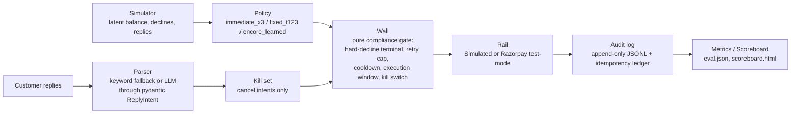

# Encore

Compliance-first retry policy for failed UPI AutoPay / card e-mandate debits —
learns **when** to retry inside a hard wall that decides **whether** a retry
is even legal, never the other way around.

## 1. The problem

UPI AutoPay mandates fail to execute at a rate that would be a P0 outage in
any other payments system, and merchants have almost no compliant room to
react. NPCI data reported by Business Standard puts UPI AutoPay revocations
at **20M+ mandates cancelled per month**, mostly over low customer balances
([Business Standard, Sept 2025](https://www.business-standard.com/finance/news/upi-autopay-revocations-hit-20-mn-monthly-over-low-customer-balances-125090700500_1.html)).
NPCI data reported via Mint puts the **August 2025 AutoPay execution failure
rate at 55–90%** across public and private banks in a single month
([Mint, via HT Syndication](https://www.htsyndication.com/mint/article/upi-autopay-s-recurring-woes-are-forcing-an-industry-rethink/93925664)).
Even in steady state, UPI AutoPay's structural failure rate — one bank
authorization per debit, no persistent card-network token — sits at a
reported **8–15%, versus 2–3% for card mandates**
([productgrowth.in AutoPay guide](https://productgrowth.in/insights/fintech/upi-autopay-guide/)).
Every one of those failures is a subscription that silently churns unless
someone retries it — and NPCI's own rules constrain how: **one original
execution plus three retries, only in non-peak windows**
([Paytm, on NPCI's Aug-2025 UPI rules](https://paytm.com/blog/payments/upi/upi-rules-update-august-1-npci-new-guidelines/)).
Encore is a policy layer for that narrow, rule-bound retry budget: recover
what NPCI's own retry allowance permits, and refuse everything it doesn't —
never the reverse.

## 2. The metrics table

Pasted verbatim from `runs/eval.json`, the real output of
`uv run encore eval` — seeds `[100, 101, 102]`, `n_customers=500` per seed,
one model trained once on regime `r0_base`, seeds `1`–`5` only (never on an
eval seed). Money is in ₹, Indian digit grouping, exactly as `encore report`
renders it on `runs/scoreboard.html`.

| Regime | Policy | Recovered / 1000 failures | Recovery / attempt | Max contacts / customer | Parked | Violations |
|---|---|---:|---:|---:|---:|---:|
| r0_base | immediate_x3 | ₹0.00 | ₹0.00 | 0 | ₹41,417.00 | 0 |
| r0_base | fixed_t123 | ₹68,040.91 | ₹70.61 | 3 | ₹26,448.00 | 0 |
| r0_base | encore_learned | ₹1,88,259.09 | ₹426.98 | 3 | ₹0.00 | 0 |
| r1_shifted | immediate_x3 | ₹0.00 | ₹0.00 | 0 | ₹2,07,341.00 | 0 |
| r1_shifted | fixed_t123 | ₹52,774.63 | ₹31.01 | 3 | ₹1,68,235.00 | 0 |
| r1_shifted | encore_learned | ₹1,50,291.50 | ₹104.67 | 3 | ₹95,975.00 | 0 |
| r2_no_signal | immediate_x3 | ₹0.00 | ₹0.00 | 0 | ₹2,63,444.00 | 0 |
| r2_no_signal | fixed_t123 | ₹34,005.26 | ₹16.09 | 3 | ₹2,37,600.00 | 0 |
| r2_no_signal | encore_learned | ₹1,07,677.63 | ₹56.71 | 3 | ₹1,81,609.00 | 0 |

- **`immediate_x3` recovers ₹0.00 in every regime by design, not by bug.**
  It retries an hour after failure, every time — which always lands just
  outside the wall's 22:00–07:00 execution window, so it burns its entire
  3-attempt budget on `outside_execution_window` and `cooldown_active`
  denials and never once reaches the rail. That's the whole point of
  including it: the wall enforcing the window *is* the lesson, and the
  denial breakdown in `runs/scoreboard.html` shows exactly which rule
  caught it, per regime.
- `compliance_violations` is `0` in every cell — see the violations caveat
  in Limitations below for what that number can and cannot prove.
- Regimes: `r0_base` is what the model trained on; `r1_shifted` moves the
  salary-day distribution later in the month and raises decline rates (a
  held-out distribution shift); `r2_no_signal` keeps `r0_base`'s rates but
  destroys the salary-day timing signal entirely (`uniform_credits=True`).
  See `src/encore/evaluate.py`'s `REGIMES` for the exact parameters.

## 3. Architecture



The LLM parser (`src/encore/parser.py`'s `parse_llm`) only ever sees customer
replies, and only ever produces a `pydantic`-validated `ReplyIntent`. It
cannot propose an amount, an hour, or a retry — it can only add a
`customer_id` to the kill set the wall checks first, before anything else.
It never touches the rail.

## 4. Quickstart

```bash
uv sync
uv run pytest
uv run encore eval
uv run encore report
```

`uv run encore eval` runs the full regime × policy matrix and writes
`runs/eval.json`; `uv run encore report` reads that file and writes
`runs/scoreboard.html` (the source of the table in section 2). To see the
real Razorpay test-mode rail exercised end to end without touching the
network or spending a real `reference_id`, run:

```bash
uv run encore demo --dry-run
```

which runs the same scheduler/wall/audit path against `SimulatedRail`
instead of the live Razorpay client.

## 5. Where we chose not to use AI

- **The wall never sees a model.** `src/encore/wall.py` is a pure function
  of `(action, state, config)` — no I/O, no clock, no randomness, no LLM
  call, enforced by project rule (`CLAUDE.md`: "wall.py stays pure").
  Whether a retry is legal is a deterministic compliance check, not
  something worth a model's judgment.
- **The stopping rule is one comparison, not a model.** `LearnedPolicy`'s
  decision to give up on a customer (`src/encore/model.py`) is
  `probs[best] * amount < cost_per_attempt`: a plain expected-value
  threshold. The model only ever picks *which hour*, inside a horizon the
  wall has already filtered to legal candidates; whether to *keep trying at
  all* is arithmetic.
- **Money math is integer paise, always.** No float ever represents an
  amount anywhere in the codebase — not in the simulator, not in the
  scheduler, not in the scoreboard's rupee formatter
  (`src/encore/report.py::format_rupees`), which only converts to a `₹`
  string at the very last step, for display. An LLM producing a number that
  becomes money is exactly the failure mode this project refuses to build.
- **The reply parser defaults to keywords, not an LLM, on the money-adjacent
  path.** `parse_keyword` (regex over Hindi/Hinglish cancel and promise
  words) is the default `parse_fn` used by `encore eval`'s kill-set
  construction. Its real, measured accuracy against the 40-row labeled set
  in `data/reply_eval.jsonl` (pinned by
  `tests/test_parser.py::test_evaluate_keyword_parser_on_labeled_set`) is:

  | Parser | accuracy (kind) | accuracy (kind + promise_day) | n |
  |---|---:|---:|---:|
  | keyword | 27/40 = **0.675** | 27/40 = **0.675** | 40 |
  | claude-haiku-4-5 | not yet measured — needs `ANTHROPIC_API_KEY` | — | 40 |
  | claude-sonnet-5 | not yet measured — needs `ANTHROPIC_API_KEY` | — | 40 |

  All 6 of the labeled set's `dispute` cases are missed — `parse_keyword`
  has no dispute detector at all and can never emit `kind="dispute"`, so
  every dispute reply falls through to `other`. That's the real gap the LLM
  columns exist to test. Run `uv run encore parse-eval` yourself (it
  auto-loads `ANTHROPIC_API_KEY` from `.env` via `load_dotenv()`) to
  populate the `claude-haiku-4-5` / `claude-sonnet-5` rows — without a key
  set, the command prints the keyword row above and explicitly says it is
  skipping the LLM rows, rather than inventing numbers for them. This
  README does not claim LLM-parser numbers that have not actually been run.
  Whichever parser wins on `dispute` recall, it still only ever feeds the
  kill set — it never proposes a retry, an hour, or an amount.

## 6. Prior art

| Product | Approach | Delta from Encore |
|---|---|---|
| [Stripe Smart Retries](https://stripe.com/en-gr/docs/billing/revenue-recovery/smart-retries) | ML timing model over 500+ attributes, no published compliance boundary specific to Indian mandates | Encore's model never gets a vote on legality — a NPCI-shaped wall does, and it's tested to catch a forged violation |
| [Chargebee Revive](https://www.chargebee.com/payments/retries-and-dunning/) | 200+ signals per failure, billing-context-aware retry timing | Same category of "when," no public claim of a hard, independently-checked compliance gate |
| [GoCardless Success+](https://gocardless.com/solutions/success-plus) | ML-picked retry date, NSF-failures only, 3 retries / 4-week window | Closest in shape (compliant-window retry timing); Encore's contribution is the wall/policy split and a post-hoc violation checker, not a better model |
| Razorpay's own fixed T+1/T+2/T+3 [subscription retries](https://razorpay.com/docs/payments/subscriptions/payment-retries/) | Fixed schedule, no learning | This is Encore's `fixed_t123` baseline, not a competitor — the metrics table above is the direct comparison |
| [Razorpay Intelligent Payment Retry](https://razorpay.com/blog/razorpay-intelligent-payment-retry/) | Checkout-time payment-*method* suggestion when a live card payment fails | Different problem entirely (real-time UX at checkout, not a scheduled recurring-mandate retry) — out of scope for Encore, mentioned only to avoid confusion with the name |

## 7. Honest limitations

- **The oracle and the rail deliberately diverge on `churn_intent`.**
  `Portfolio.would_succeed` (the labeling oracle used to train the model)
  returns `False` for any customer with latent `churn_intent=True`, even if
  their balance is sufficient — modeling "would pay if nudged, but won't
  stay a customer" as unrecoverable for training purposes. `Portfolio.debit`
  (the mechanical rail every policy is actually scored against) has no such
  check — it debits successfully if the balance clears, `churn_intent` or
  not. This affects ~5% of customers (`churn_intent=True` at `rng.random() <
  0.05`, `src/encore/simulator.py`). The bias runs **against** the learned
  policy, never for it: the model is trained to be pessimistic about
  customers the rail will actually let it recover, not the other way
  around. Pinned by
  `tests/test_simulator.py::test_churn_intent_diverges_oracle_from_debit`.
- **`compliance_violations: 0` is real, but only for what can be re-checked
  after the fact.** `evaluate.py::count_violations` replays every execution
  record's audit trail through the wall independently, and does correctly
  re-verify hard-decline-terminal, the 3-retry cap, and the execution
  window. It **cannot** re-verify `cooldown_active` post-hoc: the audit log
  has no field recording a sequence's *previous* attempt hour, so
  `last_attempt_hour` can't be reconstructed from execution records alone,
  and the checker passes `None` for it — which disables only that one wall
  check (`decide()` skips the cooldown branch on `None`). Cooldown is
  enforced live, at run time, by the same `wall.decide()` every attempt
  actually goes through — it is not unverified, just not *independently
  re-verifiable* after the fact from the audit log as it currently exists.
  See the docstring on `count_violations` in `src/encore/evaluate.py`.
- **`encore_learned`'s ~3x win on `r2_no_signal` is likely a horizon
  artifact, not learned timing.** `r2_no_signal` deliberately destroys the
  salary-day signal (`uniform_credits=True`) — there should be nothing
  timing-related left to learn. `LearnedPolicy.propose` searches up to a
  10-day candidate horizon per attempt (`_legal_candidates`,
  `src/encore/model.py`); `FixedSchedule` only ever tries exactly T+1, T+2,
  T+3. A much wider search window can "catch" more solvent moments purely
  by trying more days, independent of whether the model learned anything
  real. Read that ~3x number as "wider search space," not "successfully
  learned a signal that doesn't exist." The `r1_shifted` win (~2.8x) is more
  plausibly real, since `r1_shifted` still has a (shifted) salary-day signal
  for the model to actually use — but it shares the same horizon-mismatch
  confound with the fixed baseline, so read it as directionally honest, not
  as a horizon-controlled result. A horizon-matched baseline (`FixedSchedule`
  searching the same 10-day window) is the natural next experiment and has
  not been run.
- **Months are 30 days, always** (`DAYS_PER_MONTH = 30`,
  `src/encore/domain.py`). No real calendar, no leap years, no 28/29/31-day
  variation.
- **Every rupee figure is simulator-relative.** `recovered_per_1000_failures`
  and every other money figure in this README come from a synthetic
  `Portfolio`, not a production ledger. Read the table as *policy A beats
  policy B on this simulator's rules*, not as a real-world revenue lift
  claim.
- **What test mode cannot prove.** Razorpay's test account used for this
  build offers no UPI checkout method at all — only Cards, Netbanking, and
  Wallet (`docs/spike-notes.md`, `BROKELOG.md`'s first entry) — so nothing
  here exercises the actual UPI AutoPay execution path end to end; all
  "real rail" evidence is via Netbanking's mock bank page instead. More
  fundamentally, a failed payment attempt does **not** move a Payment
  Link's `status` out of `created` — `created` is indistinguishable from
  "nobody has tried yet" from the polling API alone
  (`docs/spike-notes.md`, "Key finding for Task 11's polling design"). The
  demo's poller therefore classifies real failures as
  `no_terminal_status_within_timeout`, never as an explicit `failure` — test
  mode can prove the success path and the timeout path, but not a clean
  positive "the bank declined this" signal from the API surface actually
  used here.
- **NPCI rules are modeled on, with citations — never claimed as
  compliant.** `WallConfig`'s retry cap, cooldown, and execution window
  (`src/encore/wall.py`) are shaped by the NPCI retry-allowance and
  non-peak-window reporting cited in section 1, and by no formal compliance
  review, legal sign-off, or NPCI certification. This project models the
  publicly reported shape of the rule; it does not claim to be an NPCI- or
  RBI-compliant system, and nothing here should be read as such.

## Other references

- `BROKELOG.md` — the append-only record of what broke while building this
  and how each was resolved, seven entries as of this commit. Not
  duplicated here; read it directly for the real failures, root causes, and
  fix commits behind several of the numbers and caveats above.
- `AGENTS.md` — repo map, exact commands, and the non-negotiable engineering
  rules, written for whoever (human or agent) picks this repo up next.
